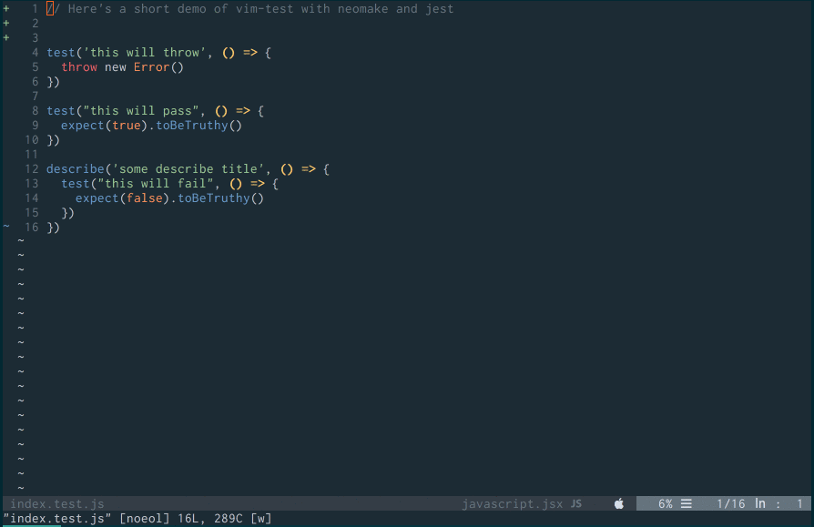

# Jest reporter for Vim's QuickFix



A [reporter](https://facebook.github.io/jest/docs/en/configuration.html#reporters-array-modulename-modulename-options)
for the [`jest`](https://facebook.github.io/jest/) testing framework that cleans
strips down most of the output for use with make or [vim-test](https://github.com/janko-m/vim-test)
and the quickfix window.

The output is compatible with Vim's default errorformat.

## Usage

```
yarn add --dev jest-vim-reporter
```

## With [vim-test](https://github.com/janko-m/vim-test) (recommended)

In your `.vimrc`:

```viml
let g:test#javascript#jest#options = '--reporters jest-vim-reporter'
```

(optional) Here's my full configuration using [vim-plug](https://github.com/junegunn/vim-plug). I tested a bunch of strategies and the one that seems to work best with neovim is Neomake.

```viml
Plug 'janko-m/vim-test' " run test from vim
Plug 'neomake/neomake' " runs make asynchronously in background

let g:test#javascript#jest#options = '--reporters jest-vim-reporter'
let g:test#strategy = 'neomake'
```

## With make

```viml
set makeprg=./node_modules/.bin/jest\ --reporters\ jest-vim-reporter
```


If you don't want to install a dependency, just clone this repo or copy the
`index.js` file and use an absolute path to it as the reporter.


## Development

Here's a development setup for testing this plugin:

```sh
yarn install
```

Create `test.out`

```sh
./node_modules/.bin/jest --reporters ./index.test.js > test.out
```

In your `.vimrc`:

```viml
" fake make prog so it's faster to get to quickfix window
set makeprg=cat\ test.out
" auto open quickfix window on make
autocmd QuickFixCmdPost [^l]* nested cwindow
autocmd QuickFixCmdPost    l* nested lwindow
```

Run:

```sh
vim -c ":make"
```

## LICENSE

[MIT](https://opensource.org/licenses/MIT)
